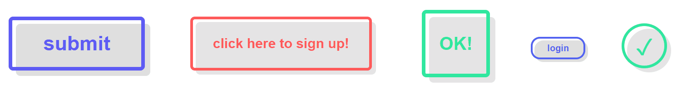

# This repository contains a React.js component to create hollow shadow buttons.

## Example:


## Usage:
1. copy the ShadowButton.js file or its content into your React project.
2. import the ShadowButton component to your file:
    ```js
    import ShadowButton from './ShadowButton';
    ```
3. instantiate the ShadowButton component, e.g:
    ```html
    <ShadowButton 
        class={"yourShadowButton"} onClickFunction={this.yourClickFunction} text={"your text"} styles=
            {{
                width: "300px", 
                height: "120px", 
                borderWidth: "8px", 
                fontSize: "45px", 
                color: "rgb(94, 91, 245)"
            }}
    />
    ```
4. position the button in a CSS file using your given class name, e.g:
    ```css
    .yourShadowButton {
        position: absolute;
        top: 100px;
        left: 100px;
    }
    ```

## Documentation:

### props:
| prop | |
| ------------- |:-------------:|
| ```class``` | A class identifier for your button. |
| ```text``` | The inner text of your button. |
| ```onClickFunction``` | The function your want to call by pressing your button. |
| ```styles``` | A json object storing the style properties of your button (see below). |


### style properties:
| style property | required | default |
| ------------- |:-------------:| -----:|
| ```width``` | yes | - |
| ```height``` | yes | - |
| ```color``` | yes | - |
| ```borderWidth``` | no | ```"6px"``` |
| ```borderRadius``` | no | ```"10px"``` |
| ```fontFamily``` | no | ```"Arial"``` |
| ```fontSize``` | no | ```"20px"``` |
| ```opacity``` | no | ```".125"``` |
| ```zIndex``` | no | ```1``` |
#### Note: only ```zIndex``` is an integer, all other properties are strings.


## More examples (code for the buttons in the GIF above):
```html
<ShadowButton class={"btn1"} text={"submit"} onClickFunction={this.clickFunction} styles={{width: "300px", height: "120px", borderWidth: "8px", fontSize: "45px", color: "rgb(94, 91, 245)"}}/>
                <ShadowButton class={"btn2"} text={"click here to sign up!"} onClickFunction={this.clickFunction} styles={{width: "400px", height: "120px", borderWidth: "6px", fontSize: "30px", color: "rgb(255, 90, 90)", opacity: ".1"}}/>
                <ShadowButton class={"btn3"} text={"OK!"}onClickFunction={this.clickFunction}  styles={{width: "150px", height: "150px", borderWidth: "8px", fontSize: "40px", color: "rgb(48, 232, 159)", opacity: ".1"}}/>
                <ShadowButton class={"btn4"} text={"login"} onClickFunction={this.clickFunction} styles={{width: "120px", height: "50px", borderWidth: "4px", borderRadius: "20px", fontSize: "20px", color: "rgb(82, 98, 241)"}}/>
                <ShadowButton class={"btn5"} text={"✓"} onClickFunction={this.clickFunction} styles={{width: "100px", height: "100px", borderWidth: "6px", borderRadius: "100%", fontSize: "50px", color: "rgb(48, 232, 159)", opacity: ".1"}}/>
            
```